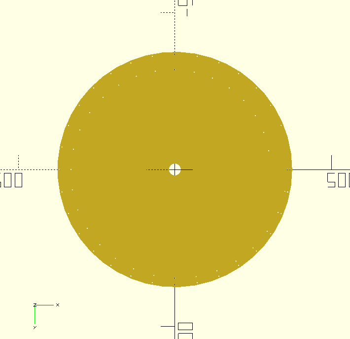

# nipkow-disk-generator
tl;dr: This started with some very old PHP code I wrote that generates Nipkow disks as PDFs. It won't work without equally ancient software to run on.Now in 2023 I've updated it by porting the basic idea to OpenSCAD.

##nipkow.php
Nearly 20 years ago I wanted to make a Baird mechanical TV system using Panasonic 2x CD-ROM drives that had DC motors. Thus I wrote this code to generate Nipkow disk templates. In the end I never got beyond making a Nipkow disk, and the rest is lost to time. It was written in PHP 4, using the now long ago deprecated PDF library that came with that version. Thus it won't work on any remotely recent PHP versions. It's legacy code presented here for interest only, should you wish to write your own Nipkow generator using its trigonometry. I will not develop it any further, it's an ancient project, you're on your own.

The PDF is a template frommthe PHP code for a standard CD-ROM. Print, stick, and drill.

##nipkow.scad
Having said I'd never develop it any further, I've ported the basic idea to OpenSCAD. Plenty of comments in the file should help you make a disk to your liking.

